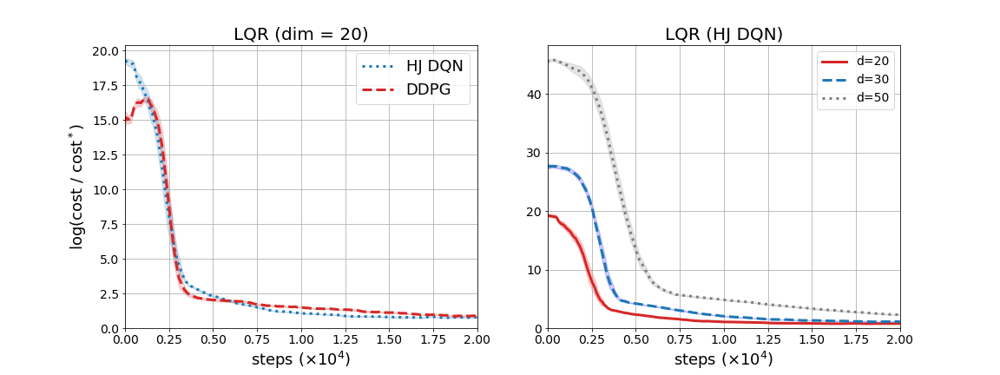

Hamilton-Jacobi DQN
====================================================

This repository includes an official PyTorch implementation of **Hamilton-Jacobi DQN (HJ DQN)**,
and [DDPG][ddpglink] as a baseline.
In addition to continuous control tasks from [OpenAI Gym][gymlink], we include results on high-dimensional Linear Quadratic Regulator problems.

## 1. Requirements


To run our code, the followings must be installed:

- **Python**

- **[Gym][gymlink]**

- **[Pytorch][pytorchlink]**

- **[MuJoCo][mujocolink]**

- **[mujoco-py][mujocopylink]**


For complete installation of mujoco-py, make sure you already have a MuJoCo activation key under `~/.mujoco`.
We successfully run the codes with Python 3.6, Gym 0.15, Pytorch 1.4, and mujoco-py 2.0.2.


## 2. Installation
Once you have completed installation of all required packages, 
run the following command within a shell.
```
$ cd hjdqn && pip install -e .
```
It is recommended that you activate a separate virtual environment during installation.

We also provide custom gym environment to test algorithms on LQR tasks. To install these environments, move to `gym_lqr` folder and install the package as follows:
```
$ cd gym_lqr && pip install -e .
```
By doing so, you register these new environments to gym registry, which enables you to create LQR environment instances by simply calling `make` function. The following code will make a 20-dimensional LQR environment:
```
env = gym.make('LinearQuadraticRegulator20D-v0')
```


## 2. Training/Evaluation
We provide a comprehensible interface for applying algorithms.
For instance, to train a HJ DQN agent on HalfCheetah-v2 for 1 million steps,
 you may run the following command:
```
$ python main.py --algo=hjdqn --env=HalfCheetah-v2 --max_iter=1e6
```

 You may specify the values of the hyperparameters of your agent.
 For example, to set the size of control constraint and the learning rate,
 add `--L` and `--lr` to your command as follows:
```
$ python main.py --algo=hjdqn --env=HalfCheetah-v2 --max_iter=1e6 --lr=5e-4 --L=30
```

 Evaluation of the agent is done every 2000 steps of interactions by default.
 You may adjust evaluation interval by simply adding the option `--eval_interval`.
 

 ## 3. Loading Training/Evaluation Data
 During training, all of the training/evaluation logs are saved at the directory `eval_log`.
  If you run DDPG on Hopper-v2, then the corresponding evaluation log will be written in `.csv` format,
and be located under `eval_log/Hopper-v2/`.

## 4. Results
### 4.1 MuJoCo Benchmark Problems

We provide a summary of the experimental results on MuJoCo benchmark problems. 
For each task, we run HJ DQN for 1 million steps across 5 random seeds, and compared the score with that of DDPG.
To generate these plots, evaluation are done over 5 episodes every 2000 steps. 
More concrete discussion and analysis of the result can be found in the paper.


### 4.2 Linear Quadratic Regulator
We also tested our novel algorithm on high-dimensional Linear Quadratic Regulator(LQR) problems.

Since the default experimental setting of our code is MuJoCo-oriented, you need to adjust extra experiment-related parameters to successfully reproduce LQR experiments.

For instance, to reproduce the result over 20-dimensional LQR with HJ DQN, run the following command:

```
$ python main.py --env=LinearQuadraticRegulator20D-v0 --algo=hjdqn --L=10 --lr=1e-3 --max_iter=2e4 --ep_len=1 --eval_interval=50 --fill_buffer=0 --start_train=400 --batch_size=512 --gamma=0.99999
```

A detailed analysis of the result can be found in the paper. Here we include figures which show the experimental results at once.



[ddpglink]: https://arxiv.org/abs/1509.02971


[gymlink]: https://gym.openai.com/
[pytorchlink]: https://pytorch.org/
[mujocolink]: http://www.mujoco.org/
[mujocopylink]: https://github.com/openai/mujoco-py
